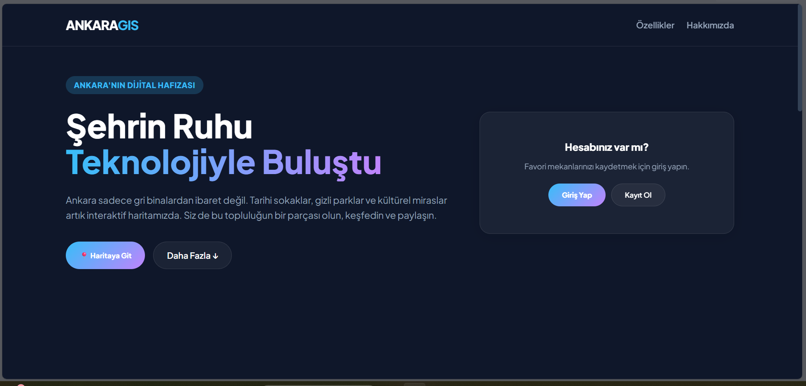
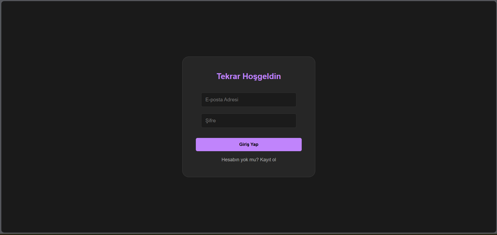
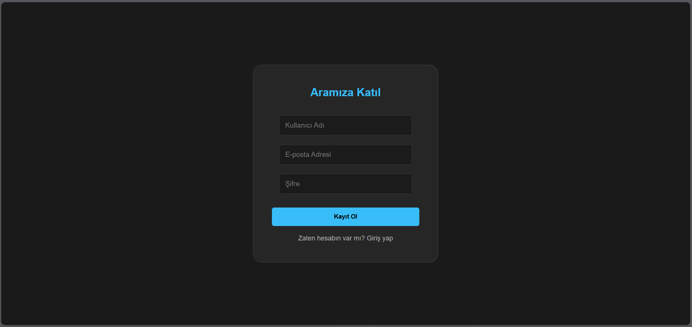
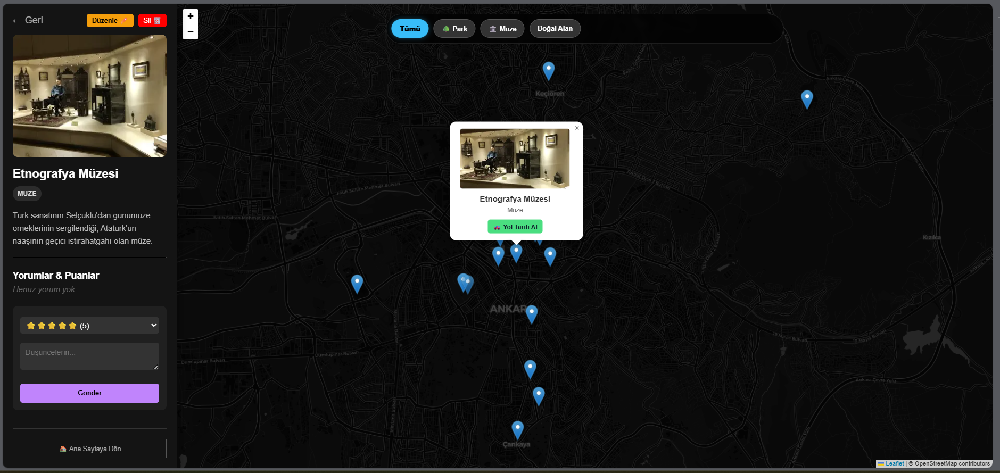
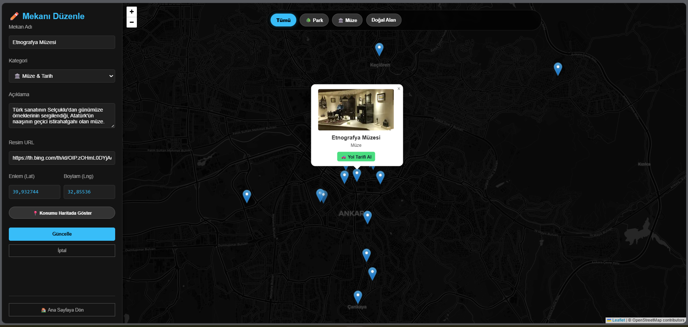
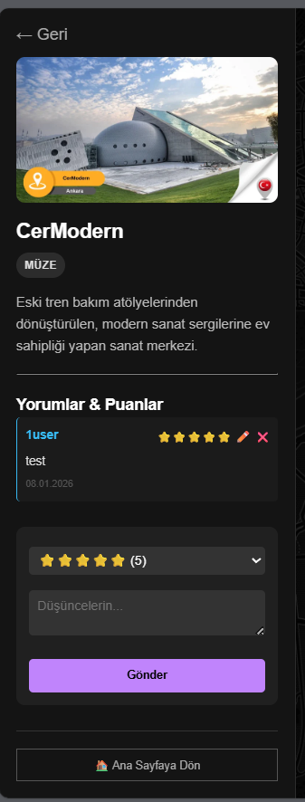
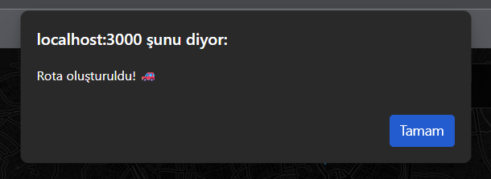
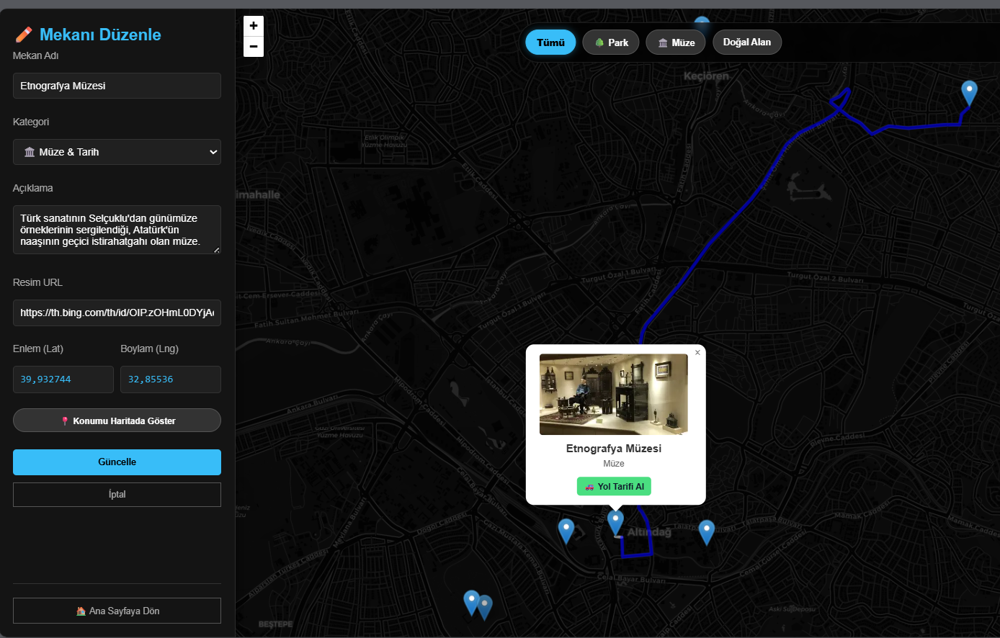
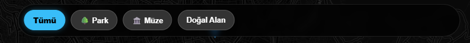
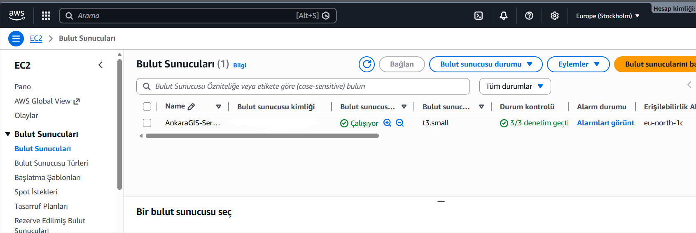

# GMT 458 – Web GIS Final Assignment: Full Stack Web GIS 
## AnkaraGIS Application

  The **Ankara GIS** application presents Ankara's historical streets, hidden parks, natural beauties, and cultural heritage alongside its grey landscape through an interactive map. This README.md explains the infrastructure used to build the application and what it meets in the **Final Assignment: Full Stack Web GIS** course. First, the AnkaraGIS application will be described, and a link to the AWS server will be shared. Second, what it meets in Full Stack Web GIS will be explained with supporting images.

---
Copy the AWS server link and open it in your browser: http://16.16.253.167:3000 
---
**Note:** Server continuity is ensured by the **PM2** process manager running in the background.  

## Application Guide

The first page of this application greets us with icons for map access, registration, and login, while the bottom contains the application's features and "About" section. Clicking the registration and login icons opens different pages below, where you can log in and register.  

  

  

  

When you click the map icon, a map and a section on the left panel change depending on who is logged in. This panel opens information screens for the locations you click on.

  

If you log in as an admin or moderator, adding and editing locations becomes active.

  

If you log in as a user, commenting, rating, and editing on the location review panel becomes active.

  

Alternatively, you can view locations and draw routes as a guest without logging in, but you cannot express your opinions about the location; you can only read the comments.

 

The map page has a panel at the top. You can use this panel to categorize and view locations.

  

  

  

  

  

  

  

  

