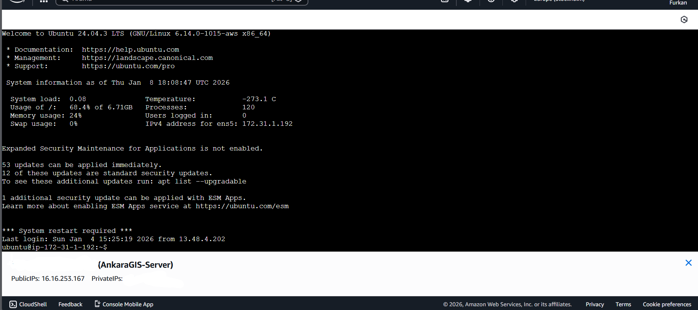
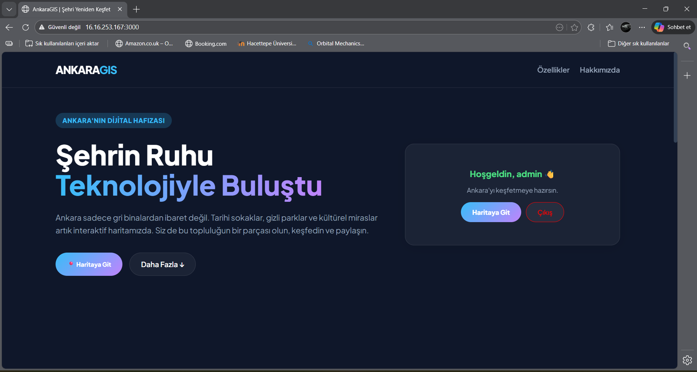
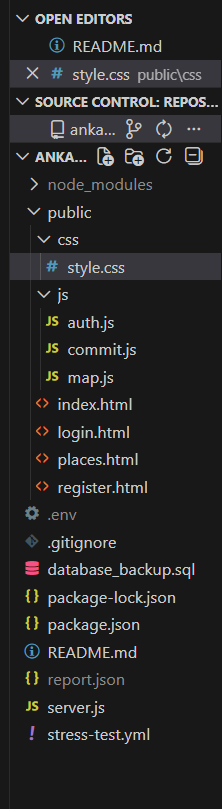
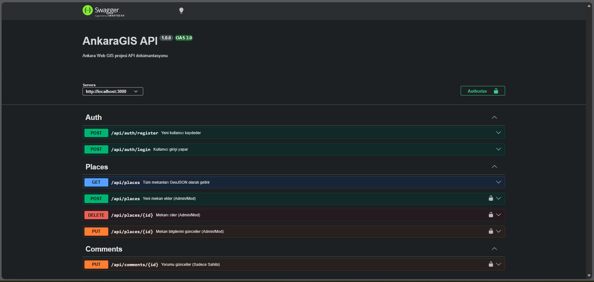
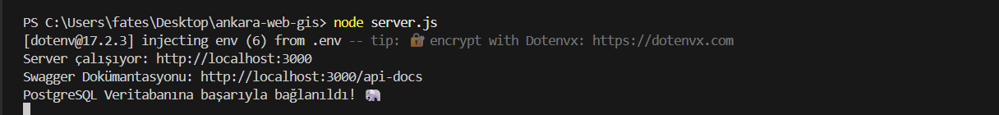
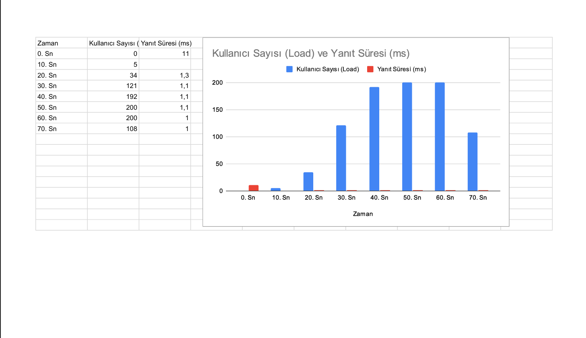
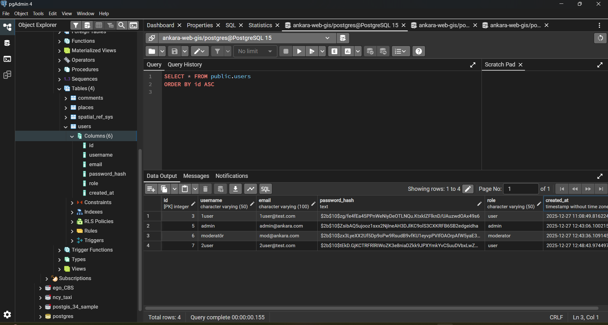
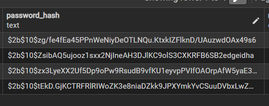
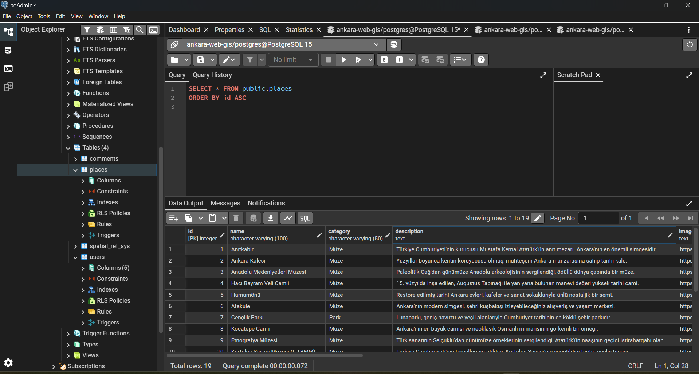
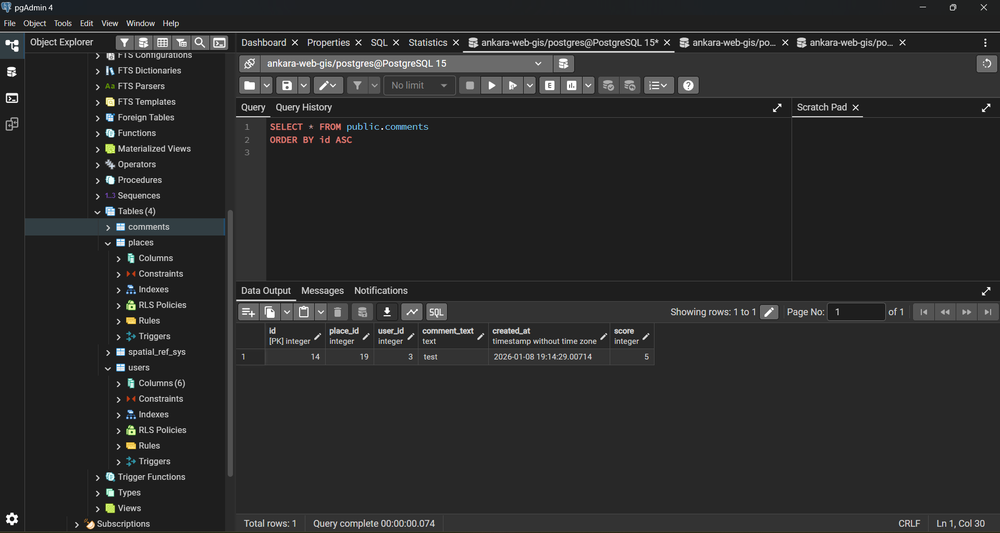

# GMT 458 – Web GIS Final Assignment: Full Stack Web GIS 
## AnkaraGIS Application

  The **Ankara GIS** application presents Ankara's historical streets, hidden parks, natural beauties, and cultural heritage alongside its grey landscape through an interactive map. This README.md explains the infrastructure used to build the application and what it meets in the **Final Assignment: Full Stack Web GIS** course. First, the AnkaraGIS application will be described, and a link to the AWS server will be shared. Second, what it meets in Full Stack Web GIS will be explained with supporting images.

---
Copy the AWS server link and open it in your browser: http://16.16.253.167:3000 
---
**Note:** Server continuity is ensured by the **PM2** process manager running in the background.  

## Application Guide

The first page of this application greets us with icons for map access, registration, and login, while the bottom contains the application's features and "About" section. Clicking the registration and login icons opens different pages below, where you can log in and register.  

  

  

  

When you click the map icon, a map and a section on the left panel change depending on who is logged in. This panel opens information screens for the locations you click on.

  

If you log in as an admin or moderator, adding and editing locations becomes active.

  

If you log in as a user, commenting, rating, and editing on the location review panel becomes active.

  

Alternatively, you can view locations and draw routes as a guest without logging in, but you cannot express your opinions about the location; you can only read the comments.  

**Note:** This application creates all kinds of routes on the local computer, but it cannot create routes on the given link connected to the server. This is because, since the application does not have a domain, the internet does not see "https" as secure and does not allow it to use the location.

 

  

The map page has a panel at the top. You can use this panel to categorize and view locations.

  

---
## ✅ Implemented Course Requirements
This project successfully fulfills the technical requirements set for the Final Assignment. Below is a detailed breakdown of the implemented items:

### 1. Hosting on AWS (20%)
The entire application infrastructure is deployed on the cloud to ensure accessibility and reliability.  

Platform: AWS EC2 (Ubuntu Server).  

Process Management: The application runs continuously in the background using PM2, ensuring zero downtime even if the console is closed.

Live Access: The project is publicly available at http://16.16.253.167:3000.  

  

  

  

### 2. API Development & Documentation (25%)
A robust RESTful API manages the communication between the client (Leaflet Map) and the server.

Technology: Node.js & Express.

Documentation: The API endpoints are fully documented using Swagger UI, making it easy to understand the backend structure. You can access the docs at /api-docs.

Endpoints: Includes GET, POST, and DELETE methods for managing spatial data (Places) and users.  

  

  

### 3. Performance Testing (25%)
To ensure the system can handle multiple concurrent users, a performance/load test was implemented.

Tool: Artillery load testing tool.

Implementation: A stress-test.yml configuration file is included in the project root. This file simulates user traffic to measure response times and server stability under load.  

[stress.yml](stress.yml)  

### 4. Managing Different User Types (20%)
The system implements a Role-Based Access Control (RBAC) architecture with 3 distinct roles, as shown in the Application Guide:

Guest: View-only access to the map and markers.

Registered User: Can view the map, rate places, and add comments.

Admin and Moderator: Has full control, including adding new spatial features (Create), updating details, and deleting locations.  

### 5. Authentication (15%)
Security is a core component of the application.

Mechanism: JWT (JSON Web Tokens) is used for secure session management.

Security: Passwords are encrypted using bcrypt before being stored in the database.

Flow: Users can Sign Up and Log In via dedicated pages (login.html, register.html).  

  

  

  

### 6. CRUD Operations (15%)
The project offers full CRUD (Create, Read, Update, Delete) capabilities on the geographical point layer.

Spatial Database: Data is stored in PostgreSQL with the PostGIS extension to handle geolocation data efficiently.

Functionality: Users can filter spatial data by categories (e.g., Museum, Park, Historical) using the top panel shown in the screenshots.  

  

  

  

